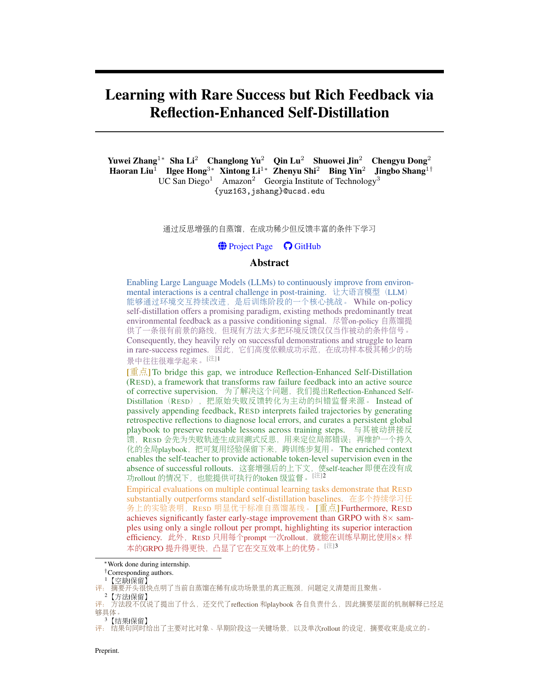
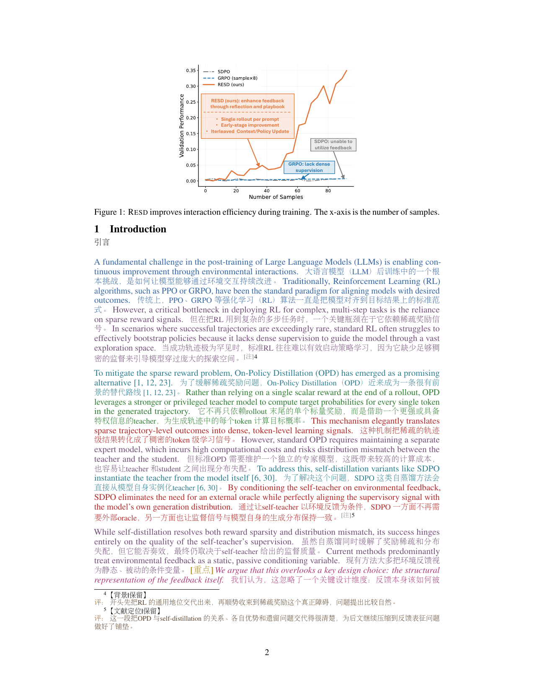
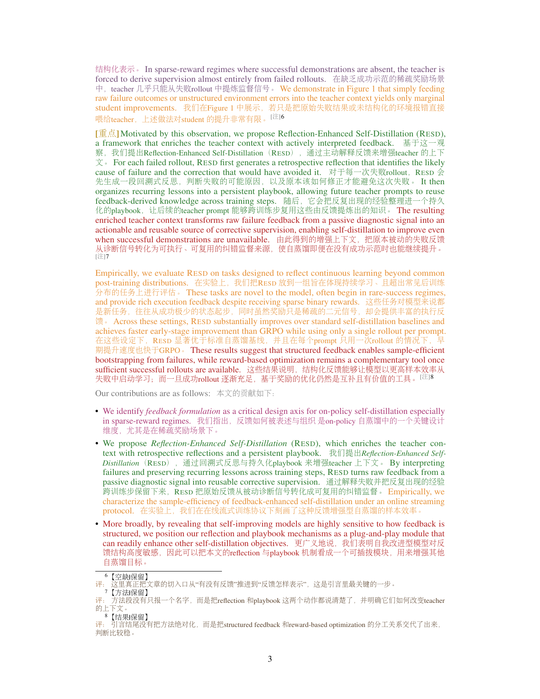
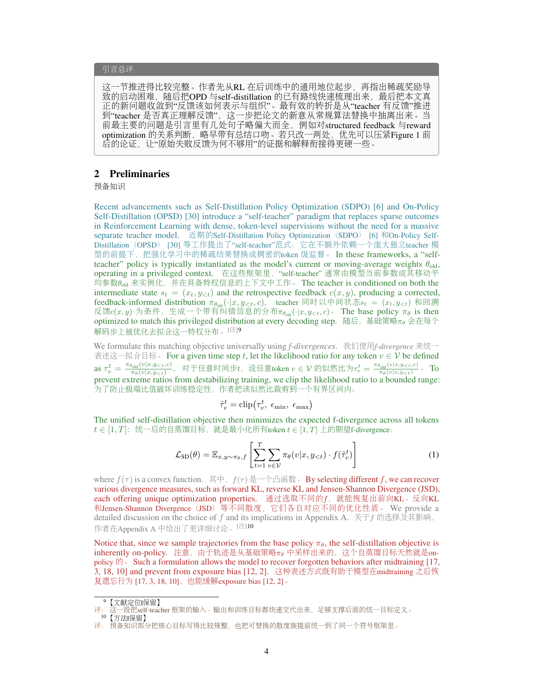
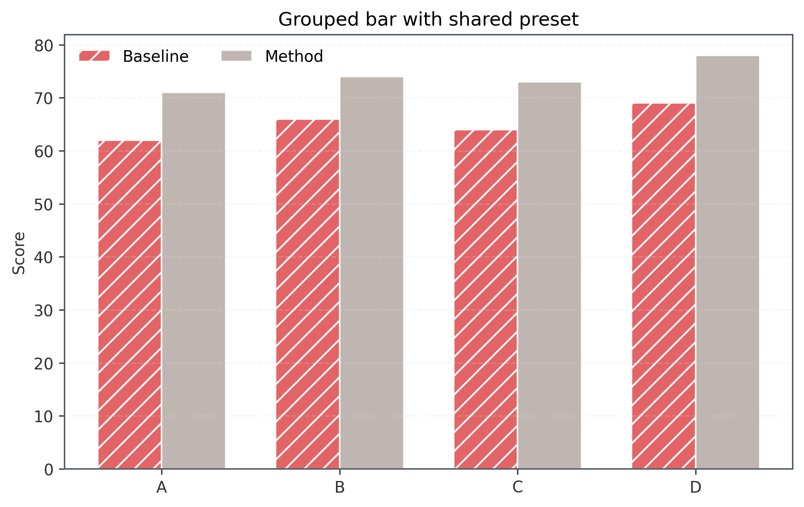
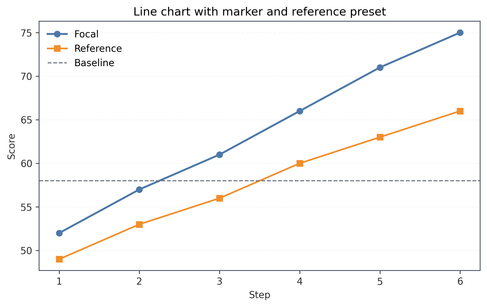
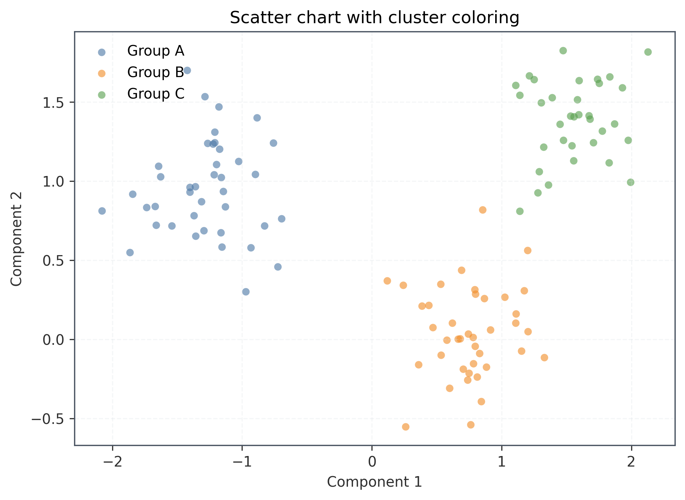
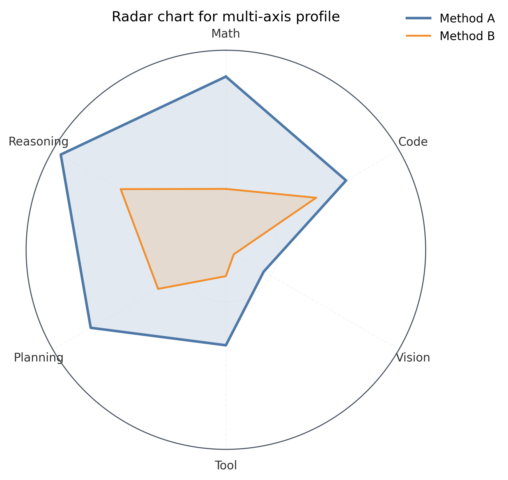

# writing-skills

这里放写论文、报告和笔记相关的 skill。

| Skill                                         | 用途                                                | Demo                                                        |
| --------------------------------------------- | --------------------------------------------------- | ----------------------------------------------------------- |
| [paper-note-skill](paper-note-skill/SKILL.md) | 把论文源码整理成双语批注阅读版，产出可编译 PDF。    | [paper_note_bilingual.pdf](assets/paper_note_bilingual.pdf) |
| [plot-skill](plot-skill/SKILL.md)             | 用 `matplotlib` 维护可复用的论文图表脚本和 preset。 | [examples](plot-skill/examples/)                            |

## Demo

### paper-note-skill

- [paper_note_bilingual.pdf](assets/paper_note_bilingual.pdf)

<table>
  <tr>
    <td></td>
    <td></td>
  </tr>
  <tr>
    <td></td>
    <td></td>
  </tr>
</table>

### plot-skill

<table>
  <tr>
    <td></td>
    <td></td>
  </tr>
  <tr>
    <td></td>
    <td></td>
  </tr>
</table>
